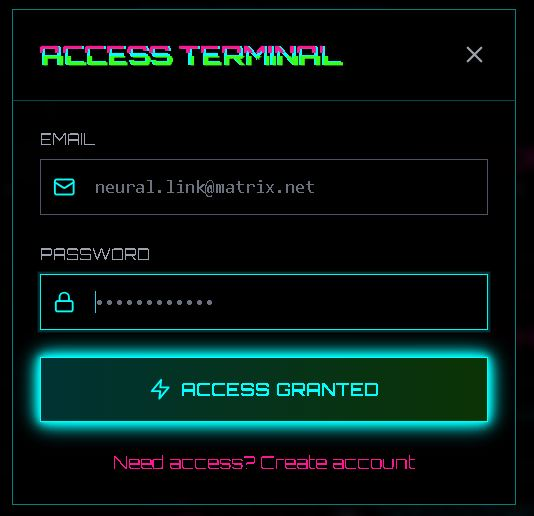
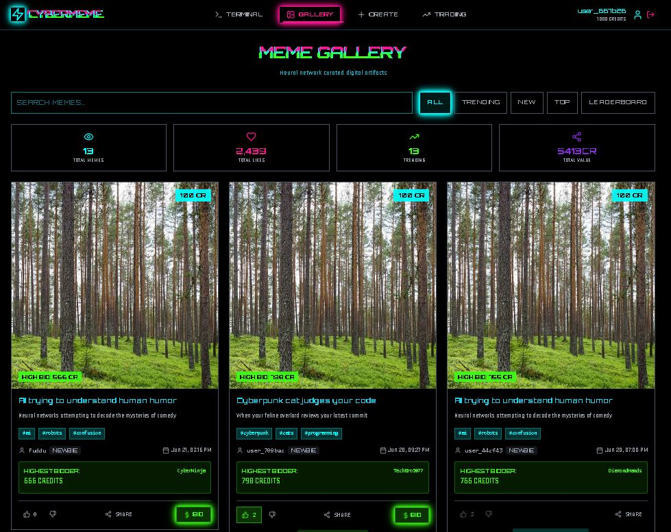
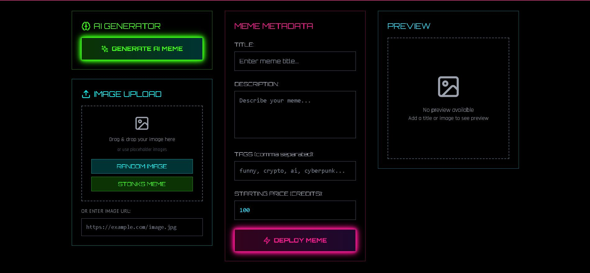

# CyberMeme Trading Platform

[CyberMeme Trading Platform link](https://stellar-raindrop-690ca3.netlify.app/)

A futuristic web application for creating, sharing, and trading memes in a cyberpunk-themed environment. This platform combines social media features with trading mechanics, allowing users to upvote memes, place bids, and execute trades in real-time.







## 🚀 Features

- **Real-time Trading**: Buy and sell memes using Socket.IO for instant updates
- **Meme Creation**: Upload and create memes with AI-assisted caption generation
- **Interactive UI**: Cyberpunk-themed interface with animations and effects
- **User Authentication**: Secure login and registration via Supabase
- **Responsive Design**: Works on desktop and mobile devices
- **Leaderboard**: Track top meme creators and traders

## 🔧 Tech Stack

### Frontend
- React with TypeScript
- Vite for fast development and building
- Tailwind CSS for styling
- Framer Motion for animations
- Socket.IO client for real-time communication
- Supabase for authentication and database

### Backend
- Node.js with Express
- Socket.IO for real-time updates
- RESTful API endpoints

## 📋 Prerequisites

- Node.js (v16 or higher)
- npm or yarn
- Supabase account for database and authentication

## 🛠️ Installation

1. Clone the repository
   ```bash
   git clone https://github.com/yourusername/cybermeme-trading-platform.git
   cd cybermeme-trading-platform
   ```

2. Install dependencies
   ```bash
   npm install
   ```

3. Create a `.env` file in the root directory with the following variables:
   ```
   VITE_SUPABASE_URL=your_supabase_url
   VITE_SUPABASE_ANON_KEY=your_supabase_anon_key
   ```

## 🚀 Usage

### Development

1. Start the backend server
   ```bash
   npm run server
   ```

2. In a separate terminal, start the frontend development server
   ```bash
   npm run dev
   ```

3. Open your browser and navigate to `http://localhost:5173`

### Building for Production

```bash
npm run build
```

The built files will be in the `dist` directory.

## 🌐 Deployment

This project is set up for deployment on Netlify or Vercel (frontend) and Render (backend). See the [DEPLOYMENT.md](./DEPLOYMENT.md) file for detailed instructions.

### Quick Deployment Steps

1. **Frontend (Netlify or Vercel)**:
   - Push your code to a Git repository
   - Import your repository in Netlify or Vercel
   - Configure environment variables (Supabase URL, API URL, etc.)

2. **Backend (Render)**:
   - Connect your Git repository to Render
   - Configure the web service with proper environment variables
   - Deploy the service

## 🧩 Project Structure

```
├── server/             # Backend server code
│   └── index.js        # Express and Socket.IO server
├── src/
│   ├── components/     # React components
│   ├── context/        # React context providers
│   ├── hooks/          # Custom React hooks
│   ├── lib/            # Utility libraries
│   └── types/          # TypeScript type definitions
├── public/             # Static assets
├── .env                # Environment variables
└── vite.config.ts      # Vite configuration
```

## 🔄 Real-time Features

The application uses Socket.IO to provide real-time updates for:

- Meme creation and updates
- Bids and trades
- User interactions (upvotes, comments)

## 🔐 Authentication

User authentication is handled through Supabase, providing:

- Email/password authentication
- Social login options
- JWT token management
- User profile management

## 🤝 Contributing

1. Fork the repository
2. Create your feature branch (`git checkout -b feature/amazing-feature`)
3. Commit your changes (`git commit -m 'Add some amazing feature'`)
4. Push to the branch (`git push origin feature/amazing-feature`)
5. Open a Pull Request

## 📄 License

This project is licensed under the MIT License - see the LICENSE file for details.

## 🙏 Acknowledgments

- [React](https://reactjs.org/) - Frontend library
- [Vite](https://vitejs.dev/) - Frontend tooling
- [Supabase](https://supabase.io/) - Backend as a Service
- [Socket.IO](https://socket.io/) - Real-time communication
- [Tailwind CSS](https://tailwindcss.com/) - CSS framework
- [Framer Motion](https://www.framer.com/motion/) - Animation library
